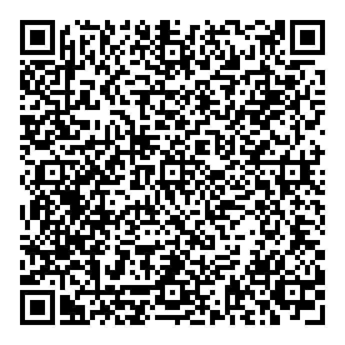

# 🎯 Capture the Drone - Control Repository

**Central helpdesk, scoring, and coordination hub for the Capture the Drone challenge.**

---

## 📋 What is This Repository?

This is the **Control Repository** for the "Capture the Drone" challenge. The challenge consists of two phases:

**Phase 1: Environment Setup (Individual Assignment)**
- Setup WSL2 and Ubuntu 24.04
- Install ROS2 Jazzy
- Configure Python, UV, and MCAP tools
- Visualize radar data
- **Non-competitive, no points** – This phase enables as many participants as possible to join Phase 2

**Phase 2: Multi-Target Tracking Challenge (Team Assignment)**
- Implement radar tracking algorithms
- Competitive challenge with points
- Builds on the environment setup from Phase 1

This repository serves as the central hub for:

✅ **Setup Support** – Get help with Phase 1 environment setup – **collaborative, non-competitive, no points**  
✅ **Help Requests** – Ask other teams for technical assistance during Phase 2 (they earn collaboration points!)  
✅ **Questions & Clarifications** – Get answers about challenge rules, scope, deadlines, and evaluation  
✅ **Collaboration Scoring** – Track and recognize teams helping each other  
✅ **Infrastructure Bug Reports** – Report issues with provided datasets, evaluation scripts, or central inventory  

---

## 📝 How to Register for the Challenge

Before you can participate in the "Capture the Drone" challenge, please complete the following registration steps:

### Step 1: Create a GitHub Account
If you don't already have one, register for a free account at [github.com](https://github.com).

### Step 2: Request Participation
Provide us with your participation request either **in person** or **via email to [bats-rising-challenge@bosch.com](mailto:bats-rising-challenge@bosch.com)**. Make sure to include:
- ✅ Your **GitHub profile name** (username)
- ✅ Your full name
- ✅ Contact information (email)

  

We will then add you to the `bats-rising-challenge-participants` team.

### Step 3: Join GitHub Classroom
Once we've added you to the team, join the **Phase 1 GitHub Classroom assignment** using the link below:

  

Then confirm that you can successfully access:
- ✅ This challenge coordination repository
- ✅ Your Phase 1 GitHub Classroom assignment (environment setup)

**Note:** If you have any issues accessing the challenge after registration, please contact the coordinators immediately.

### What Happens Next?

After registration, you'll start with **Phase 1: Environment Setup** (individual, non-competitive). Once you complete the setup, you'll be ready for **Phase 2: Multi-Target Tracking Challenge** (team-based, competitive).

---

## ⚠️ What This Repository is NOT For

❌ **No Challenge Code** – Your tracking algorithms, MCAP parsers, and implementations belong in your team's GitHub Classroom assignment repository  
❌ **No Code Submissions** – All code submissions happen through GitHub Classroom  
❌ **No Direct Solutions** – Teams should provide guidance and hints, not copy-paste solutions  

---

## 🔗 Important Links

- **Challenge GitHub Classroom Assignment**: [Link to be added]
- **Setup GitHub Classroom Assignment**: [Link to be added]
- **Challenge Overview**: See your team repository for full challenge details
- **Technical Documentation**: Available in your team's starter code

---

## 🧰 Phase 1: Environment Setup Support (Individual Assignment)

**Goal:** Setup WSL2, Ubuntu 24.04, ROS2 Jazzy, and visualize radar data to prepare for Phase 2.

### When to Use Setup Help

Use the **Setup Help** template during **Phase 1** (individual environment setup assignment) for issues with:
- WSL2 installation or configuration
- Ubuntu 24.04 setup
- ROS2 Jazzy installation
- Python, UV, or package management
- MCAP tooling setup
- Radar data visualization
- Development environment problems

### Setup Support Rules

**Phase 1 is collaborative and non-competitive:**

✅ **No Points Awarded** – Helping others with setup does NOT earn collaboration points  
✅ **Helping Encouraged** – You're encouraged to help classmates, but it's not scored  
✅ **Safe Environment** – This is a learning phase; ask questions freely  
✅ **Transparent Issues** – Setup problems are visible and solutions are reusable  

**When asking for setup help:**
1. **Search existing issues first** – Your problem may already be solved
2. **Include complete context** – OS version, ROS2 version, error messages, logs
3. **Show what you've tried** – Demonstrate your troubleshooting attempts
4. **Close when resolved** – Add 👍 and explain what worked to help others

**When helping with setup:**
- No pressure – help if you can, but this isn't tracked or scored
- Explain your solution so others can learn
- Point to documentation or resources when helpful

**Important:** Setup help is **only for Phase 1 (individual environment setup assignment)**. Once you move to Phase 2 (team tracking challenge), use the **Help Request** template instead (which DOES earn collaboration points).

---

## 🆘 Phase 2: How to Request Help (Team Tracking Challenge)

### When to Use Help Requests

Use the **Help Request** template during **Phase 2** (team tracking challenge) when you're stuck on:
- Radar signal processing or tracking algorithms
- ROS2 MCAP parsing issues
- Python/UV/Click tooling problems
- Kalman filtering or data association
- Implementation bugs or errors

### Rules for Help Requests

1. **One Issue Per Problem** – Keep issues focused and specific
2. **Include Context** – Must provide:
   - Your team name
   - Link to your team repository
   - What you've already tried
   - Specific error messages or code snippets
3. **No Direct Code Copying** – Asking for help is encouraged; copying entire solutions is not
4. **Close When Resolved** – Comment with 👍 and close the issue once your problem is solved
5. **Award Quality Help** – If someone provides exceptional assistance, add the `quality-help` label

### How Teams Earn Collaboration Points

Teams earn points by helping others:

| Help Type | Base Points | Quick Response (<30 min) | Quality Help Bonus |
|-----------|-------------|--------------------------|-------------------|
| Text guidance | 15 pts | +10 pts | +5 pts |
| Code examples | 20 pts | +10 pts | +5 pts |
| **Maximum** | **30 pts** | **+10 pts** | **+5 pts** |

**Quality Help (`quality-help` label):**
- Requesting team adds the label when closing
- Coordinators validate and award bonus points
- Reserved for truly exceptional, teaching-focused help

---

## ❓ How to Ask Questions

Use the **Question** template for:
- Challenge rules clarification
- Scope and requirements questions
- Deadline or timeline inquiries
- Evaluation criteria questions
- General challenge logistics

**Before asking:**
1. Check the Challenge Overview in your repository
2. Search existing issues
3. Review pinned issues in this repository

Questions are answered by challenge coordinators, not other teams.

---

## 🐞 How to Report Infrastructure Bugs

Use the **Infrastructure Bug Report** template for issues with:
- Central inventory or provided datasets
- Evaluation scripts or autograding
- ROS2 MCAP sample data
- Setup instructions or tooling
- Challenge infrastructure (not your code!)

**Required Information:**
- Affected component (dataset, script, etc.)
- Steps to reproduce the bug
- Expected vs. actual behavior
- Environment details (OS, Python version, etc.)

Infrastructure bugs are handled by coordinators with high priority.

---

## 🏷️ Issue Labels Guide

### Type Labels
- `setup-help` – Individual environment setup help (pre-challenge, non-competitive, no points)
- `help-request` – Technical assistance from other teams (during challenge, earns points)
- `question` – Clarification from coordinators
- `infra-bug` – Infrastructure or tooling issues

### Domain Labels
- `radar` – Radar signal processing, tracking algorithms
- `ros2` – ROS2 integration, MCAP parsing
- `python` – Python tooling, UV, Click CLI
- `evaluation` – Scoring, metrics, autograding
- `inventory` – Central datasets or resources

### Special Labels
- `quality-help` – Exceptional help deserving bonus points (added by requesting team, validated by coordinators)

---

## ⏱️ Response Times

**Help Requests:**
- Other teams typically respond within 30 minutes during challenge hours
- Quick responses (<30 min) earn bonus collaboration points

**Questions:**
- Coordinators respond during scheduled review times (typically 12:00 and 18:00)

**Infrastructure Bugs:**
- High priority – coordinators investigate immediately
- Expect updates within 1 hour during challenge hours

---

## 🚨 Moderation & Fair Play

### Moderator Review Schedule
Issues are reviewed at:
- **12:00** – Midday check-in
- **18:00** – Evening review
- **Ad-hoc** – Critical blockers escalated immediately

### Blocked Teams
If your team is blocked for **>2 hours**, coordinators will:
1. Escalate to specialist agents (Radar Expert, ROS2 Specialist, etc.)
2. Provide targeted guidance
3. Ensure all teams have equal opportunities to progress

### Fair Collaboration
- **Encouraged:** Explaining concepts, sharing approaches, pointing to documentation
- **Discouraged:** Copy-pasting complete solutions, doing work for other teams
- **Forbidden:** Sharing evaluation test case solutions

### Non-Participant Issues
Issues from non-participants may be closed by moderators.

---

## 📊 Collaboration Scoring

Your team's collaboration score is calculated from:
- Number of help requests answered
- Quality of help provided
- Response time bonuses
- `quality-help` validations

**Scoring is transparent:**
- All help is tracked via issue comments and labels
- Coordinators validate `quality-help` claims
- Final scores published at end of challenge

**Tips for Maximum Points:**
- Provide clear, teaching-focused explanations
- Include code examples when helpful
- Respond quickly to earn bonus points
- Focus on helping teams understand, not just fixing their code

---

## 🎓 Teaching Philosophy

This challenge emphasizes **learning through collaboration**:
- Helping others deepens your own understanding
- Receiving help with context builds better problem-solving skills
- Competition is balanced with teamwork

**When helping:**
- Ask guiding questions before providing answers
- Explain the "why," not just the "how"
- Connect concepts to real-world radar applications
- Encourage experimentation

**When asking for help:**
- Show what you've tried first
- Be specific about what you don't understand
- Follow up with what you learned

---

## 📞 Getting Started

1. **Read the pinned "READ FIRST" issue** for important information
2. **Choose the right issue template** based on your need
3. **Search existing issues** to avoid duplicates
4. **Provide complete information** in your issue
5. **Engage constructively** with responses
6. **Close issues** when resolved with 👍

---

## 🏆 Challenge Timeline

### Phase 1: Environment Setup (Individual, Non-competitive)
**Goal:** Setup your development environment and visualize radar data

- Setup WSL2 and Ubuntu 24.04
- Install ROS2 Jazzy
- Configure Python, UV, and package management
- Install MCAP tooling
- Visualize radar data
- Complete environment verification

**No points awarded** – This phase prepares you for Phase 2

### Phase 2: Multi-Target Tracking Challenge (Team-based, Competitive)

**Day 1: Setup & Exploration**
- MCAP data exploration
- Basic CLI tool structure
- Initial algorithm planning

**Day 2: Data Processing**
- MCAP parsing and ROS2 message extraction
- Radar data preprocessing
- Single-target tracking

**Day 3: Multi-Target Tracking**
- Data association algorithms
- Track management
- Kalman filter tuning

**Day 4: Evaluation & Presentation**
- Algorithm testing
- Performance optimization
- Team demonstrations

---

## 📝 Issue Template Quick Links

- [🧰 Setup Help (Phase 1 - Individual Assignment)](./.github/ISSUE_TEMPLATE/setup-help.md)
- [🆘 Help Request (Phase 2 - Team Challenge)](./.github/ISSUE_TEMPLATE/help-request.md)
- [❓ Question](./.github/ISSUE_TEMPLATE/question.md)
- [🐞 Infrastructure Bug](./.github/ISSUE_TEMPLATE/infrastructure-bug.md)

---

## 🤝 Contact

For urgent issues or concerns that don't fit any template, contact the challenge coordinators directly via your team's communication channel.

---

**Good luck, and happy tracking! 🎯📡**
